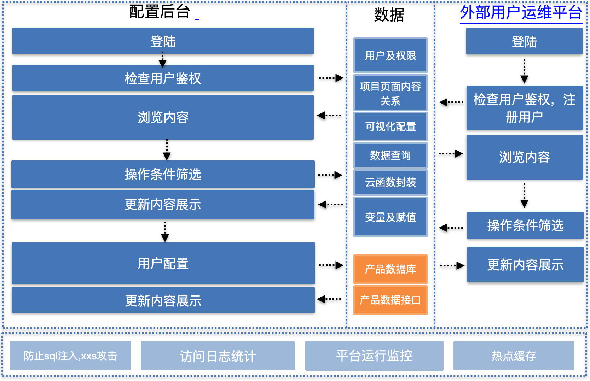
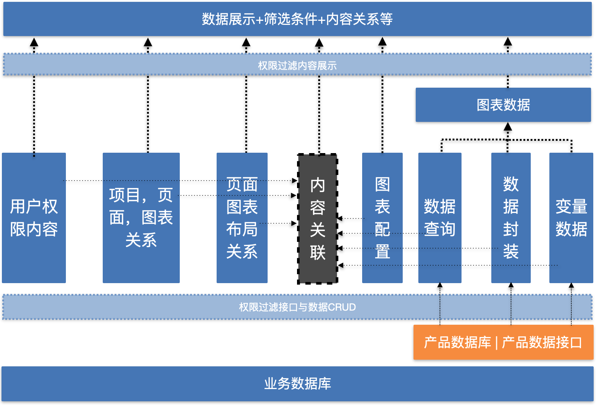
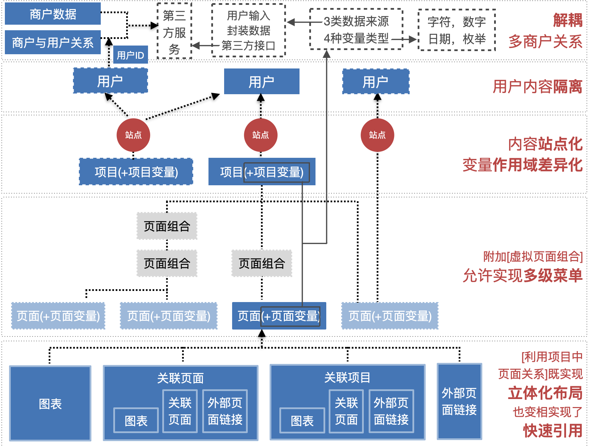

### 项目描述
> 提供一个平台，能够快速基于客户的数据输入，按照客户的需求进行多维度，多方式的数据可视化输出。客户可以对可视化数据输出按权限进行分配，进行管理和使用，为线下生产提供相应的数据预测与数据支撑。
### 项目主体
- 
- 内部配置平台
  - 定义数据源，
  - 设置数据筛选，数据输入
  - 定义数据视图，
  - 设置数据显示
  - 设置数据
- 外部数据监控平台
  - 数据查看
  - 相关数据筛选
  - 数据的分享

### 实现细节
- 
- 数据流顺序依次为
- >原始数据
- >筛选数据
- >组装数据
- >数据可视化配置
- >数据权限配置

### 关于项目与租户
- 
- 基于配置能力的相互嵌用，使内容的输出更加快速和多样性
- 提供站点，页面，数据的三重权限控制，为更加多样的客户关系提供灵活的权限控制
