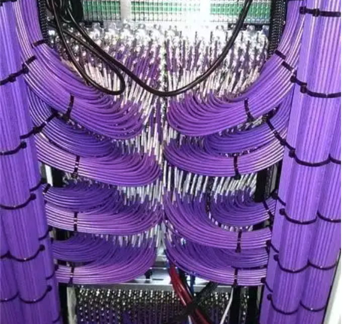

# 说说微服务

## 目录
- [背景](#背景)
- [概念](#概念)
- [特点](#特点)
- [误解](#误解) 
- [改进](#改进) 

## 背景
项目中有幸接手了一个“微服务”架构的项目，然后从开始的各种不方便，上手慢，到中期的硬着头皮上，吃得苦，霸得蛮；再到最后的励精图治，舒经活络。我对于“微服务”架构也有了一个不深不浅的体会和认识。所以借github这块宝地也说说自己的一些事后感想。

## 概念
微服务是一种功能应用的架构和组织方法，其中功能应用由通过明确定义的 API 进行通信的小型独立服务组成。这些服务可能由各个团队独立负责。

## 特点
- 自主性
    可以对微服务架构中的每个组件服务进行开发、部署、运营和扩展，而不影响其他服务的功能。这些服务不需要与其他服务共享任何代码或实施。各个组件之间的任何通信都是通过明确定义的 API 进行的。
- 专用性
    每项服务都是针对一组功能而设计的，并专注于解决特定的问题。如果开发人员逐渐将更多代码增加到一项服务中并且这项服务变得复杂，那么可以将其拆分成多项更小的服务。

## 误解
为什么刚接手项目时会各种不方便，上手慢呢？ 因为项目的微服务，只有其名，而无其意。 

项目确实是多个微服务了，而各个服务之前的组织与调用关系，却完全是一团糟。怎么理解这事呢？ 我为大家举个很简单的例子：网络的形成，当只有2台电脑需要共享数据时，彼此连接即可，每台电脑1套进出端口即可； 3台时，还继续彼此直接连接，可以每台2套进出端口即可； 4台呢? 5台呢？更多呢？ 想想当这么多电脑要彼此共享数据时，每台电脑得需要多少套进出端口呢？ 之间的联线会如何交织？ 后期如何维护？ 

其实我所提到的对微服务误解就指这种场景。因为很多人在关注微服务时，都更多的是关注了将功能模块独立为一个服务，却完全忽视了服务之间的组织关系。要知道这可能会让一个微服务架构的引入，由好事变成坏事。

## 改进
针对误解，如何改进呢？我们总结为一句，就是利用微服务解耦进行独立管理，强调组织关系优化调用链路。

基于功能规划解耦服务，是微服务架构的第一步，第二步就是需要合理组织。那我们可以看看怎么合理组织呢？ 还是可以借鉴一下网络架构。

如图所示，我们可以总结关键几点:
- 微服务的接口分两类
    - 私有 : 操作自身负责的功能模块或读写自身功能的数据库
    - 公有 : 可能被外部或其他微服务调用的功能接口
- 注册服务(内外之分可以是物理隔离或逻辑隔离，按实际需要决定)
    - 对内场景: 
        - A服务使用到B服务接口时
        - A服务读写B服务对应的数据库时
    - 对外场景
        - 需暴露外网的接口

这样做的目的，能保证以下几点：
- 真正的功能解耦！不存在跨服务间的错乱调用关系出现
- 注册服务统一注册，统一管理。 可按各自需要扩展命名空间，类，网络区域等各种概念，以适应不同场景需要。