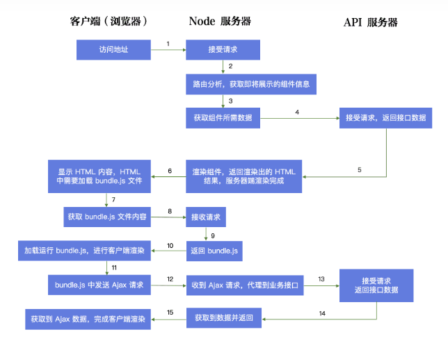

# SSR详谈

## 前言
说到 SSR，很多人的第一反应是“服务器端渲染”。首先我们来看看“客户端渲染”，“服务器端渲染”，“同构”这三个概念。我们假设借助react来讨论后续的一些话题。当然无论是react还是vue在本质概念上也是相似的。
- **客户端渲染(CSR: Client Side Render)** 
客户端渲染，页面初始加载的 HTML 页面中无网页展示内容，需要加载执行JavaScript 文件中的 React 代码，通过 JavaScript 渲染生成页面，同时，JavaScript 代码会完成页面交互事件的绑定。
- **服务端渲染(SSR: Server Side Render)**
用户请求服务器，服务器上直接生成 HTML 内容并返回给浏览器。服务器端渲染来，页面的内容是由 Server 端生成的。一般来说，服务器端渲染的页面交互能力有限，如果要实现复杂交互，还是要通过引入 JavaScript 文件来辅助实现。服务器端渲染这个概念，适用于任何后端语言。
- **同构**
同构这个概念存在于 Vue，React 这些新型的前端框架中，同构实际上是客户端渲染和服务器端渲染的一个整合。我们把页面的展示内容和交互写在一起，让代码执行两次。在服务器端执行一次，用于实现服务器端渲染，在客户端再执行一次，用于接管页面交互。

## 为什么我们需要SSR这种同构技术呢？
一般情况下，当我们使用 React 编写代码时，页面都是由客户端执行 JavaScript 逻辑动态挂 DOM 生成的，也就是说这种普通的单页面应用实际上采用的是客户端渲染模式。在大多数情况下，客户端渲染完全能够满足我们的业务需求，为什么我们需要SSR这种同构技术呢? 

**原因:**
- CSR的TTFP比较长
- CSR项目的SEO能力极弱

## SSR执行图


## SSR技术点剖析
从上图可以看出SSR的引入，不可避免的会让项目更复杂。我们可以理一理SSR的一些细节。

- **虚拟DOM是SSR中肯定会涉及的**。

    SSR 的工程中，React 代码会在客户端和服务器端各执行一次。但这两次的执行确实不同的。一个是在浏览器环境执行；一个是在Node环境执行(Node环境下，是没有Dom这个概念的)。 但React框架引入了虚拟Dom的概念， React的影响页面实现其实真实过程是先操作虚拟Dom, 而不是真实的Dom， 这其实就是基于JS内存实现的对象，然后通过diff算法找出差异变化，再去影响真实Dom。

    有了上面的说明，于是我们可以在服务器端先将虚拟Dom形成，计算好。转换相应的页面内容为字符串，等待服务接口返回数据到客户端时，浏览器即可消化相关页面内容，并展示。这也就能解释，为什么SSR在单纯的页面渲染过程会更快。注意我说的只是单单指页面在接受到服务的数据返回后到页面展示这段时间。因为这个过程中它已经不再面临CSR中可能需要的多次接口请求数据，加载，运算又请求等等之类繁琐的过程了。

- **路由的差异**

    同构过程中，我们会意识到，组件代码基本上是可以等同的，但路由的代码是不可能等同的。因为服务端的路由是请求路径，关系其路由模块；而客户端的是基于浏览器的网址。这是两种完全不一样的机制。

    - Client Side
        ```
        const App = () => {
            return (
                <Provider store={store}>
                <BrowserRouter>
                    <div>
                    <Route path='/' component={Home}>
                    </div>
                </BrowserRouter>
                </Provider>
            )
        }

        ReactDom.render(<App/>, document.querySelector('#root'))
        ```
        客户端路由代码非常简单，大家一定很熟悉，BrowserRouter 会自动从浏览器地址中，匹配对应的路由组件显示出来。

    - Server Side
        ```
        const App = () => {
            return 
            <Provider store={store}>
            <StaticRouter location={req.path} context={context}>
                <div>
                <Route path='/' component={Home}>
                </div>
            </StaticRouter>
            </Provider>
        }

        Return ReactDom.renderToString(<App/>)
        ```
        服务器端路由代码相对要复杂一点，需要你把 location（当前请求路径）传递给 StaticRouter 组件，这样 StaticRouter 才能根据路径分析出当前所需要的组件是谁。
        通过 BrowserRouter 我们能够匹配到浏览器即将显示的路由组件，对浏览器来说，我们需要把组件转化成 DOM，所以需要我们使用 ReactDom.render 方法来进行 DOM 的挂载。
        而 StaticRouter 能够在服务器端匹配到将要显示的组件，对服务器端来说，我们要把组件转化成字符串，这时我们只需要调用 ReactDom 提供的 renderToString 方法，就可以得到 App 组件对应的 HTML 字符串。

- **打包的差异**

    在 SSR 中，服务器端渲染的代码和客户端的代码的入口路由代码是有差异的，所以在 Webpack 中，Entry 的配置首先肯定是不同的。

    在服务器端运行的代码，有时我们需要引入 Node 中的一些核心模块，我们需要 Webpack 做打包的时候能够识别出类似的核心模块，一旦发现是核心模块，不必把模块的代码合并到最终生成的代码中，解决这个问题的方法非常简单，在服务器端的 Webpack配置中，你只要加入 target: node 这个配置即可。

    服务器端渲染的代码，如果加载第三方模块，这些第三方模块也是不需要被打包到最终的源码中的，因为 Node 环境下通过 NPM 已经安装了这些包，直接引用就可以，不需要额外再打包到代码里。为了解决这个问题，我们可以使用 webpack-node-externals 这个插件，代码中的 nodeExternals 指的就是这个插件，通过这个插件，我们就能解决这个问题。

    当我们的 React 代码中引入了一些 CSS 样式代码时，服务器端打包的过程会处理一遍 CSS，而客户端又会处理一遍。查看配置，我们可以看到，服务器端打包时我们用了 isomorphic-style-loader，它处理 CSS 的时候，只在对应的 DOM 元素上生成 class 类名，然后返回生成的 CSS 样式代码。

    而在客户端代码打包配置中，我们使用了 css-loader 和 style-loader，css-loader 不但会在 DOM 上生成 class 类名，解析好的 CSS 代码，还会通过 style-loader 把代码挂载到页面上。不过这么做，由于页面上的样式实际上最终是由客户端渲染时添加上的，所以页面可能会存在一开始没有样式的情况，为了解决这个问题， 我们可以在服务器端渲染时，拿到 isomorphic-style-loader 返回的样式代码，然后以字符串的形式添加到服务器端渲染的 HTML 之中。

    对于图片等类型的文件引入，url-loader 也会在服务器端代码和客户端代码打包的过程中分别进行打包，这里，我偷了一个懒，无论服务器端打包还是客户端打包，我都让打包生成的文件存储在 public 目录下，这样，虽然文件会打包出来两遍，但是后打包出来的文件会覆盖之前的文件，所以看起来还是只有一份文件。

- **异步数据的获取与Redux的使用**

    客户端渲染中，异步数据结合 Redux 的使用方式遵循下面的流程
    - 创建 Store
    - 根据路由显示组件
    - 派发 Action 获取数据
    - 更新 Store 中的数据
    - 组件 Rerender

    而在服务器端，页面一旦确定内容，就没有办法 Rerender 了，这就要求组件显示的时候，就要把 Store 的数据都准备好，所以服务器端异步数据结合 Redux 的使用方式，流程如下: 
    - 创建 Store
    - 根据路由分析 Store 中需要的数据
    - 派发 Action 获取数据
    - 更新Store 中的数据
    - 结合数据和组件生成 HTML，一次性返回

    分析下服务器端渲染这部分的流程
    - 创建 Store。注意下：
        - 客户端渲染中，用户的浏览器中永远只存在一个 Store，所以代码上你可以这么写
            ```
            const store = createStore(reducer, defaultState)
            export default store;
            ```
        - 然而在服务器端，这么写就有问题了，因为服务器端的 Store 是所有用户都要用的，如果像上面这样构建 Store，Store 变成了一个单例，所有用户共享 Store，显然不能这样实现了。 而应该返回一个函数，每个用户访问的时候，这个函数重新执行，为每个用户提供一个独立的 Store。
            ```
            const getStore = (req) => {
                return createStore(reducer, defaultState);
            }
            export default getStore;
            ```
            根据路由分析 Store 中需要的数据： 要想实现这个步骤，在服务器端，首先我们要分析当前出路由要加载的所有组件，这个时候我们可以借助一些第三方的包，比如说 react-router-config, 使用这个包，传入服务器请求路径，它就会帮助你分析出这个路径下要展示的所有组件。
            派发 Action 获取数据: 接下来，我们在每个组件上增加一个获取数据的方法：
                ```

                ```


## 参考文档
- [Webpack 官网](https://webpack.js.org/)
- [What is React Server Side Rendering and should I use it?](https://dev.to/mladenstojanovic/what-is-react-server-side-rendering-and-should-i-use-it-5b7i)
- [StaticRouter](https://reacttraining.com/react-router/core/api/StaticRouter)
- [The Pain and the Joy of creating isomorphic apps in ReactJS](https://reactjsnews.com/isomorphic-react-in-real-life)
- [Discussion in Server Side Render](https://zhuanlan.zhihu.com/p/47044039)