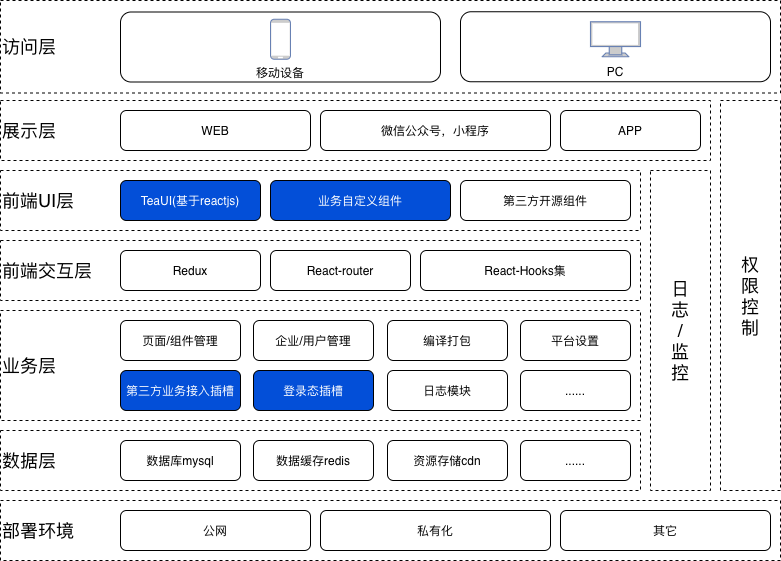
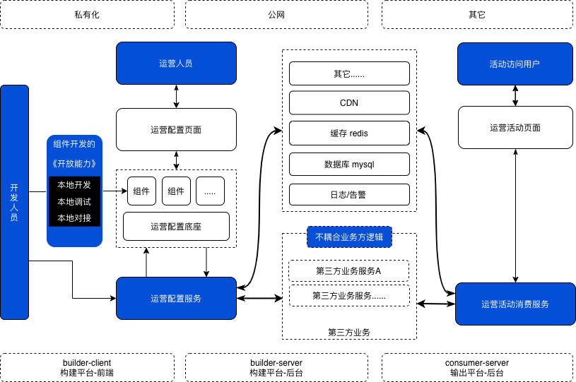
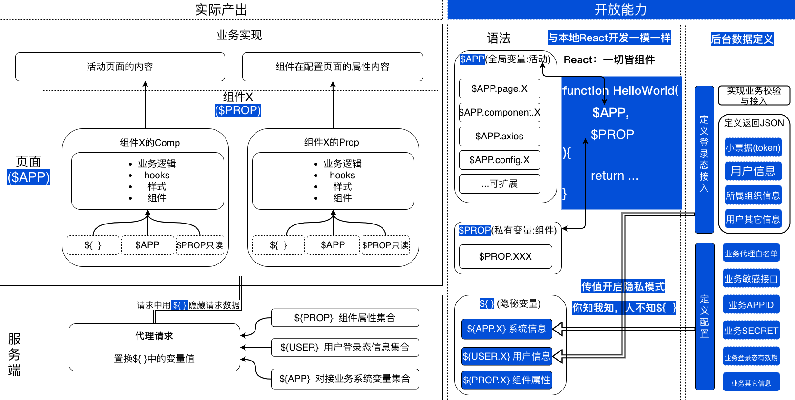

### 项目视图
- 

### 系统架构
- 

### 面向的人群
- 
- 访问H5的终端用户
  - > 他们是最终体验页面的人群；对于项目来说，在这个阶段提供相应的访问统计和监控以及必要的活动安全机制是重要的。
  - > 安全方面：不应该暴露任何敏感内容在页面请求中。以防止被小人利用进行攻击。
- 配置活动的运营人员
  - > 他们是使用组件配置页面的人群；他们做的是配置页面，对每个可能用到的组件进行相应的属性设置，对活动进行管理
  - > 安全方面：不应该暴露任何敏感内容在页面请求中。以防止被小人利用进行攻击。（这里他们会比前面提到的终端访问用户有更大的几率接触到更多敏感信息。例如业务方的某些全量数据的接口，当然这要规避这些内容都是需要第三类人群(组件开发者)在开发过程中注意遵循开发中的敏感信息控制）
- 组件接入开发者
  - > 他们是基于一定语法(该系统约定的),结合业务需求,进行业务组件的开发者。他们需要熟悉该系统的语法，也需要熟悉具体业务进行组件(抽象的功能模块)开发。
  - > 安全方面: 他们要注意三类隐私信息的使用, 因为这三类信息中有些是不能够让其暴露在页面之中的，哪怕只是页面的请求之中。
    - 组件中涉及到的用户信息
    - 组件中涉及到的系统信息
    - 组件中涉及到的自身属性信息
- 该组件的开发者(我)
  - > 我是系统的开发者，如果从面向的人群来考虑，其实我要考虑的问题，也就可以简单归纳为服务以上三类人群。下面就一一来说明。
  - > 如何服务组件开发者 : 提供合理，舒适以及安全的组件语法进行开发
  - > 如何服务运营人员 : 提供合理的平台使用交互体验
  - > 如何如何组件开发者 : 提供稳定页面访问(当然还包括不能让小人搞坏事，以及一些访问的记录)

### 语法设计
- 
- 核心概念
  - [语法](#语法)
  - [组件内置参数](#内置参数)
  - [请求时的敏感信息及相关处理](#请求时的敏感信息及相关处理)
  - [组件构成](#组件构成)
  
- #### 语法
  - 会React就行
  - 样式支持: .less, .css, .scss
  - 可import的内容
    - react及其所有自身模块
    - ahooks(常用钩子函数集合) 
    - underscore(常用辅助计算集合)
    - classnames(样式应用模块)
    - styled-components(样式应用模块)

- #### 内置参数
  
  - $APP *(Object)*
    - page *(Object 组件间的公共变量集合)*
      - color *( 组件间的公共变量 $APP.page.color="#000000"即写值; $APP.page.color即读值)*
      - xxx *( 组件间的公共变量 $APP.page.xxx="123"即写值; $APP.page.xxx即读值)*
    - component *(Object) 公共组件集合)*
      - component["_**"] *(开发者开发组件时自定义名称，_开头的则表示为外部引入的开源类公共组件)*
      - component["**"] *(开发者开发组件时自定义名称，非_开头的则表示为业务场景中封装的公共组件)*
    - axios *(http请求方法, 语法参考[axios](https://github.com/axios/axios))*
    - config *(Object) 公共集合：公共变量，公共方法)*
      - ["自定义名称"] *(开发者开发该方法时自定义名称)*
  - $PROP *Object*
    - set *Function*
    - get *Function*
  
- #### 请求时的敏感信息及相关处理
  - 哪些会是敏感的，举例
    - 情况1:不能在页面暴露的请求地址,密钥等标识(以APP作为命名空间)
    - 情况2:不能在页面暴露的用户隐私信息(以USER作为命名空间)
    - 情况3:某些组件属性(即右侧属性)中配合的值，可能是中间h5页面需要用于请求的一些“隐私”参数值
  - 接入开发时如涉及，如何处理
    - ${  } 包含住信息的key名, 
      e.g. 
      ```
      axios.get("${APP.demoUrl}",{
        params:{ token: "${USER.uid}" }
      }).then().catch()
      ```
    - ${APP.XXX} 访问接入开发者在配置页面配置的XXX的值(针对情况1, 在接入开发prop时可能用到)
      - CONFIG的内容由开发者在配置页面配置
      - 不同的产品数据彼此隔离
      - 默认传入的数据都是字符类型, 若需传入特殊格式数据(如数字，布尔值)的表达式则为: ${*KeyName}
    - ${USER.XXX} 访问当前用户的相关个人信息中的XXX的值(针对情况2, 在接入开发prop时可能用到)
    - ${PROP.XXX} 访问当前这个H5活动中这个组件的配置属性中的XXX的值(针对情况3, 在接入开发comp时可能用到)
        

- #### 组件构成: 

  每个组件结构都一样, 包含的内容为
    - 【组件内容文件】comp/index.js 
    - 【组件属性文件】prop/index.js
    - 【组件注册文件】index.js
  
  例如组件名称为"HelloWorld", 则目录结构如下:
    ```
    /HelloWorld/comp/index.js
    /HelloWorld/prop/index.js
    /HelloWorld/index.js
    ```

    - /HelloWorld/comp/index.js 这里面定义该组件显示的内容
      - 内置参数: 
        - 参数1 $PROP: Object 获得该组件相关的属性设置后的结果集合
        - 参数2 $APP: Object 获得系统内置参数集合
          -  $APP.page
              -  $APP.page.bgColor 背景颜色
              -  $APP.page.btnColor 按钮颜色
              -  $APP.page.pageTheme 主题皮肤
              -  $APP.page.pageTemplate 产品模板
          
          -  [$APP.component 内置组件](./src/builtInComponents/README.md)
              ```
              export default ({ $PROP, $APP })=>{
                return (
                  ...{ $PROP.name }
                  ...{ $PROP.width }
                )
              }
              ```
          - $APP.config
            - $APP.config.yyyy
            - $APP.config.xxxx
    - /HelloWorld/prop/index.js 这里面定义该组件相关的一些可设置的属性的内容
      - 内置参数: 
        - 参数1 $PROP: Object 去获取和设置该组件的属性值, 它包含两个方法
          - set: 设置属性值 ({key:value})
          - get: 获取属性值 (key) 或 ()
        - 参数2 $APP: Object 内置参数集合
          -  $APP.page 内置页面属性
              -  $APP.page.bgColor
              -  $APP.page.{...}
          -  $APP.utils.axios 内置请求方法（使用语法参考[axios](https://github.com/axios/axios)）
          -  [$APP.component 内置组件](./src/builtInComponents/README.md)

              ```
              export default ({ $PROP, $APP })=>{
                return (
                  ...onClick = ()=>$PROP.set({ color: 你设置的值 })
                  ...onSelect = ()=>$PROP.get("name")
                )
              }
              ```
    - /HelloWorld/index.js 组件注册信息文件
